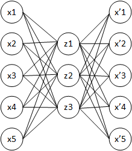
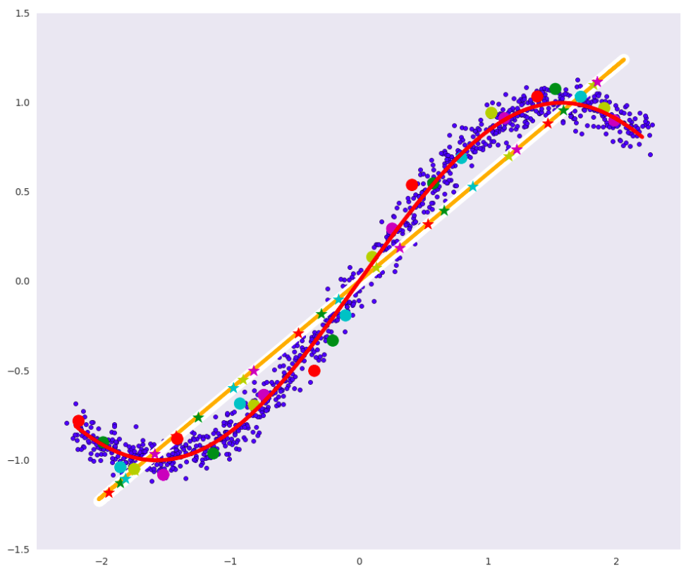
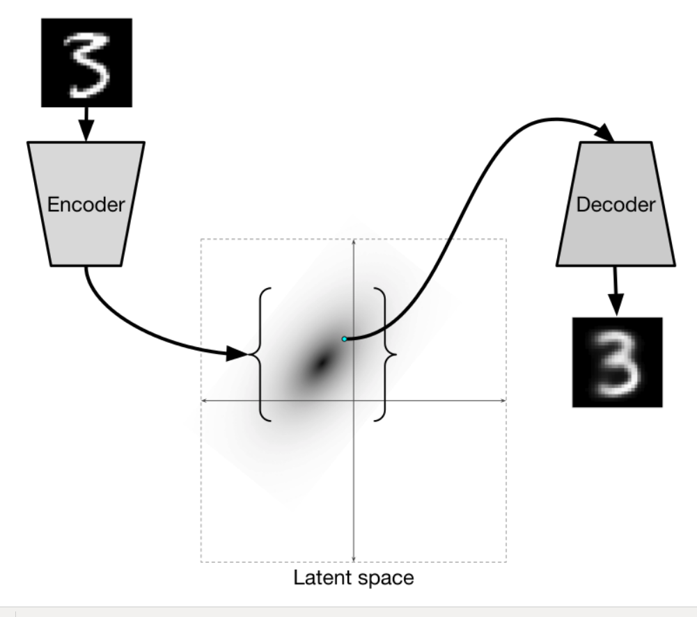
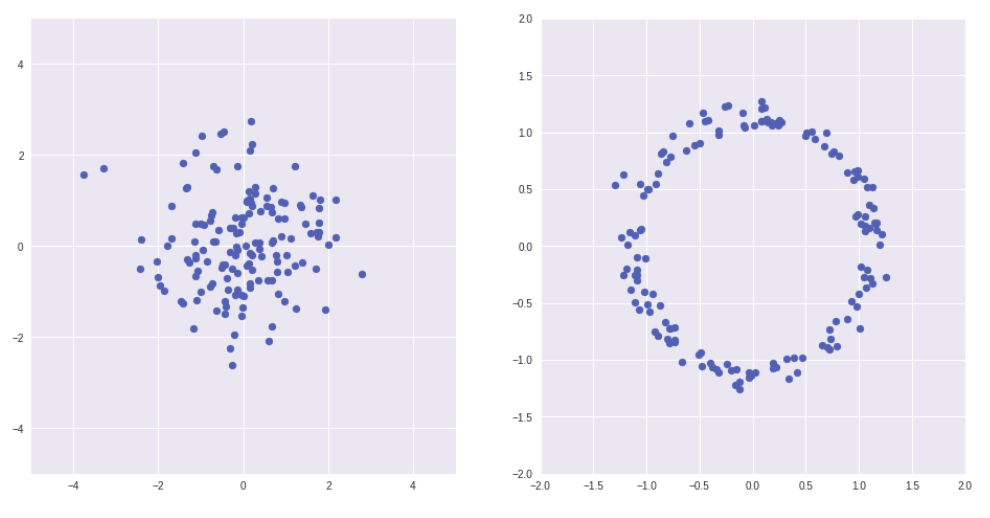
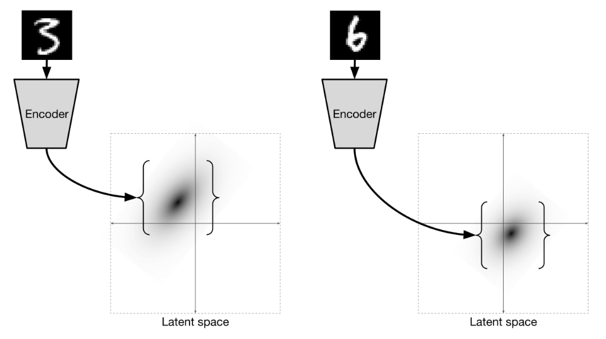
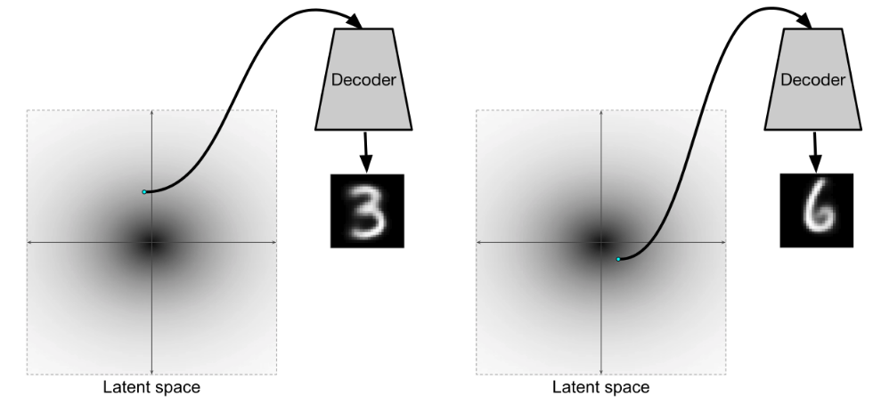
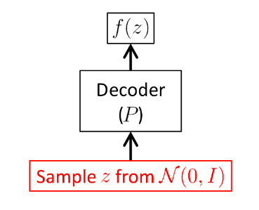

# Билет №1
## Вопрос 1: Loss functions: smooth L1, Bounding Box Regression, Triplet Loss

## Вопрос 2: Variational Autoencoders

### Autoencoders
[Истоник того, что ниже - википедия](https://ru.wikipedia.org/wiki/%D0%90%D0%B2%D1%82%D0%BE%D0%BA%D0%BE%D0%B4%D0%B8%D1%80%D0%BE%D0%B2%D1%89%D0%B8%D0%BA)

Autoencoder -- специальная архитектура искусственных нейронных сетей, позволяющая применять обучение без учителя при использовании метода обратного распространения ошибки. Простейшая архитектура автокодировщика — сеть прямого распространения, без обратных связей, наиболее схожая с перцептроном и содержащая входной слой, промежуточный слой и выходной слой. В отличие от перцептрона, выходной слой автокодировщика должен содержать столько же нейронов, сколько и входной слой.

Основной принцип работы и обучения сети автокодировщика — получить на выходном слое отклик, наиболее близкий к входному. Чтобы решение не оказалось тривиальным, на промежуточный слой автокодировщика накладывают ограничения: промежуточный слой должен быть или меньшей размерности, чем входной и выходной слои, или искусственно ограничивается количество одновременно активных нейронов промежуточного слоя — разрежённая активация. Эти ограничения заставляют нейросеть искать обобщения и корреляцию в поступающих на вход данных, выполнять их сжатие. Таким образом, нейросеть автоматически обучается выделять из входных данных общие признаки, которые кодируются в значениях весов сети. Так, при обучении сети на наборе различных входных изображений, нейросеть может самостоятельно обучиться распознавать линии и полосы под различными углами.

[Лекции](https://docs.google.com/document/d/1KN00kAWVQ55GzQWUTmA5aKEsz7VYYEEqAEohquVKz1I/edit)

Так выглядит обычный autoencoder. У нас есть вход (картинка, вектор, текст и т.д.), есть выход. Задача -- научить сеть восстанавливать вход, то есть получить на выходе вектор **X'** максимально близкий к **X**, при этом хочется в середине получать максимально маленький вектор **Z**, кодирующий **X**. 
**Z** можно рассматривать как **embedding**.

[Источник того, что ниже](https://habr.com/post/331382/)

Автоэнкодеры состоят из двух частей: энкодера $g$ и декодера $f$. Энкодер переводит входной сигнал в его представление: $h = g(x)$, а декодер восстанавливает сигнал по его коду: .

Автоэнкодер, изменяя $f$ и $g$, стремится выучить тождественную функцию $x = f(g(x))$, минимизируя какой-то функционал ошибки.

$$L(x, f(g(x)))$$

автоэнкодеры можно использовать для предобучения, например, когда стоит задача классификации, а размеченных пар слишком мало. Или для понижения размерности в данных для последующей визуализации. Либо когда просто надо научиться различать полезные свойства входного сигнала.

#### Denoising autoencoder

Автоэнкодеры можно обучить убирать шум из данных: для этого надо на вход подавать зашумленные данные и на выходе сравнивать с данными без шума:
$$L(x, f(g(\hat x))),$$
где $\hat x$ — зашумленные данные.

#### Скрытые переменные

Если рассматривать изображения в качестве вектора большой размерности и рассмотреть какое-нибудь изображение цифры из датасета mnist, то с большой долей вероятности другой вектор, из $\varepsilon-$окрестности первого вектора, будет тоже изображение цифры.

А если взять два произвольных изображения цифры, то в изначальном $784$-мерном пространстве ($28 * 28 = 784$) скорее всего, можно найти непрерывную кривую, все точки вдоль которой можно также считать цифрами (хотя бы для изображений цифр одного лейбла), а вкупе с предыдущим замечанием, то и все точки некоторой области вдоль этой кривой.

Таким образом, в пространстве всех изображений есть некоторое подпространство меньшей размерности в области вокруг которого сосредоточились изображения цифр. То есть, если наша генеральная совокупность — это все изображения цифр, которые могут быть нарисованы в принципе, то плотность вероятности встретить такую цифру в пределах области сильно выше, чем вне.

Если считать в качестве _кода_ вектор, который получается в результате работы енкодера (и этот же вектор приходит на вход декодера), то автоэнкодеры с размерностью _кода_ $k$ ищут $k$-мерное многообразие в пространстве объектов, которое наиболее полно передает все вариации в выборке. А сам _код_ задает параметризацию этого многообразия. _При этом энкодер сопоставляет объекту его параметр на многообразии, а декодер параметру сопоставляет точку в пространстве объектов._

Чем больше размерность _кодов_, тем больше вариаций в данных автоэнкодер сможет передать. Если размерность _кодов_ слишком мала, автоэнкодер запомнит нечто среднее по недостающим вариациям в заданной метрике (это одна из причин, почему mnist цифры все более размытые при снижении размерности кода в автоэнкодерах).

> Manifold - разнообразие

Для того, чтобы лучше понять, что такое _manifold learning_, создадим простой двумерный датасет в виде кривой плюс шум и будем обучать на нем автоэнкодер.

На картинке выше: 
* синие точки — данные;
* красная кривая – многообразие, определяющее наши данные.

> ##### Линейный сжимающий автоенкодер
> Самый простой автоэнкодер — это двухслойный сжимающий автоэнкодер с линейными функциями активации (больше слоев не имеет смысла при линейной активации).
> Такой автоэнкодер ищет аффинное (линейное со сдвигом) подпространство в пространстве объектов, которое описывает наибольшую вариацию в объектах, тоже самое делает и _PCA_ (метод главных компонент) и оба они находят одно и тоже подпространство.
> 
>
>
>На картинке выше:
> * белая линия – многообразие, в которое переходят синие точки данных после автоэнкодера, то есть попытка автоэнкодера построить многообразие, определяющее больше всего вариаций в данных;
> * оранжевая линия – многообразие, в которое переходят синие точки данных после PCA;
> * разноцветные кружки — точки, которые переходят в звездочки соответствующего цвета после автоэнкодера;
> * разноцветные звездочки – соответственно, образы кружков после автоэнкодера.

Можно рассмотреть множество данных $\{X\}$ как некоторый процесс их генерации, который зависит от некоторого количества скрытых переменных $Z$ (случайных величин). Размерность данных $X$ может быть намного выше, чем размерность скрытых случайных величин $Z$, которые эти данные определяют. 

Рассмотрим процесс генерации очередной цифры: то, как будет выглядеть цифра, может зависеть от множества факторов:
* желаемой цифры;
* толщины штриха;
* наклона цифры;
* аккуратности;
* и т.д.

Каждый из этих факторов имеет свое априорное распределение, например, вероятность того, что будет нарисована восьмерка — это распределение Бернулли с вероятностью 1/10, толщина штриха тоже имеет некоторое свое распределение и может зависеть как от аккуратности, так и от своих скрытых переменных, таких как толщина ручки или темперамент человека (опять же со своими распределениями).

Автоэнкодер сам в процессе обучения должен прийти к скрытым факторам, например, таким как перечисленные выше, каким-то их сложным комбинациям, или вообще к совсем другим. Однако, то совместное распределение, которое он выучит, вовсе не обязано быть простым, это может быть какая-то сложная кривая область. (Декодеру можно передать и значения извне этой области, вот только результаты уже не будут из определяющего многообразия, а из его случайного непрерывного продолжения).

Именно поэтому мы не можем просто генерировать новые $X$ из распределения этих скрытых переменных. Сложно оставаться в пределах области, а еще сложнее как-то интерпретировать значения скрытых переменных в этой кривой области.

Для определенности введем некоторые обозначения на примере цифр:
$X$ — случайная величина картинки $28*28$;
$Z$ — случайная величина скрытых факторов, определяющих цифру на картинке;
$p(X)$ — вероятность конкретного изображения цифры в принципе быть нарисованным (если картинка не похожа на цифру, то эта вероятность крайне мала);
$p(Z)$ — вероятностное распределение скрытых факторов, например, распределение толщины штриха;
$p(Z|X)$ — распределение вероятности скрытых факторов при заданной картинке (к одной и той же картинке могут привести различное сочетание скрытых переменных и шума);
$p(X|Z)$ — распределение вероятности картинок при заданных скрытых факторах, одни и те же факторы могут привести к разным картинкам (один и тот же человек в одних и тех же условиях не рисует абсолютно одинаковые цифры);
$p(X,Z)$ — совместное распределение $X$ и $Z$, наиболее полное понимание данных, необходимое для генерации новых объектов.
$$p(X,Z) = p(X|Z) p(Z)$$

:large_orange_diamond: $p(X|Z)$ нам приближает декодер;
:large_orange_diamond: $p(Z)$ на данный момент мы пока еще не понимаем.

Есть ли какой-то способ контролировать распределения скрытых переменных $P(Z)$?

Самый простой способ — добавить регуляризатор $L_1$ или $L_2$ на значения $Z$, это добавит априорные предположения на распределения скрытых переменных, соответственно, лапласса или нормальное (похоже на априорное распределение, добавляемое на значения весов при регуляризации). 

Регуляризатор вынуждает автоэнкодер искать скрытые переменные, которые распределены по нужным законам, получится ли у него — другой вопрос. Однако это никак не заставляет делать их независимыми, т.е. $P(Z_i) \neq P(Z_i|Z_j)$.

### Variational autoencoder

Для того чтобы можно было генерировать новые объекты, пространство скрытых переменных _(latent variables)_ должно быть предсказуемым.

**Variational Autoencoders** — это автоэнкодеры, которые учатся отображать объекты в заданное скрытое пространство и, соответственно, сэмплить из него. Поэтому вариационные автоэнкодеры относят также к семейству генеративных моделей.

Имея какое-то одно распределение $Z$, можно получить произвольное другое $X = g(Z)$.
Например, пусть $Z$ — обычное нормальное распределение, $g(Z) = \frac{Z}{|Z|}+ \frac{Z}{10}$ — тоже случайное распределение, но выглядит совсем по-другому.

Таким образом, если подобрать правильные функции, то можно отобразить пространства скрытых переменных обычных автоэнкодеров в какие-то хорошие пространства, например, такие, где распределение нормально. А потом обратно.

С другой стороны, специально учиться отображать одни скрытые пространства в другие вовсе не обязательно. Если есть какие-то полезные скрытые пространства, то правильный автоэнкодер научится им по пути сам, но отображать, в конечном итоге, будет в нужное нам пространство.

Ниже непростая, но необходимая теория лежащая в основе _VAE_.

На примере нарисованных цифр рассмотрим естественный генеративный процесс, который сгенерировал нашу выборку:
$$P(X) = \int_{z} P(X|Z)P(Z)dZ$$

Представим $P(X|Z)$ как сумму некоторой генерирующей функции $f(Z)$ и некоторого сложного шума $\varepsilon$

$$P(X|Z) = f(Z) + \varepsilon$$

Мы хотим построить некоторый искусственный генеративный процесс, который будет создавать объекты, близкие в некоторой метрике к тренировочным $X$.

$$P(X;\theta) = \int_{z} P(X|Z;\theta)P(Z)dZ \ \ \ (1)$$
и снова

$$P(X|Z;\theta) = f(Z;\theta) + \varepsilon,$$

где $f(Z;\theta)$ — некоторое семейство функций, которое представляет наша модель, 
а $\theta$ — ее параметры.
Выбирая метрику, мы выбираем то, какого вида нам представляется шум $\varepsilon$. Если метрика $L_2$, то мы считаем шум нормальным и тогда:
$$P(X|Z;\theta) = N(X|f(Z;\theta), \sigma^2 I),$$

По принципу максимального правдоподобия нам остается оптимизировать параметры $\theta$, для того чтобы максимизировать $P(X)$, т.е. вероятность появления объектов из выборки.

Проблема в том, что оптимизировать интеграл $(1)$ напрямую мы не можем: пространство может быть высокоразмерное, объектов много, да и метрика плохая. 
С другой стороны, если задуматься, то к каждому конкретному $X$ может привести лишь очень небольшое подмножество $Z$, для остальных же $P(X|Z)$ будет очень близок к нулю.

И при оптимизации достаточно сэмплить только из хороших $Z$.

Для того чтобы знать, из каких $Z$ нам надо сэмплить, введем новое распределение $Q(Z|X)$, которое в зависимости от $X$ будет показывать распределение $Z \sim Q$, которое могло привести к этому $X$.

Запишем сперва расстояние Кульбака-Лейблера (несимметричная мера «похожести» двух распределений, подробнее [тут](http://www.machinelearning.ru/wiki/images/d/d0/BMMO11_6.pdf) ) между
$Q(Z|X)$ и реальным $P(Z|X)$:

$$KL[Q(Z|X)||P(Z|X)] = \mathbb{E}_{Z \sim Q}[\log Q(Z|X) - \log P(Z|X)]$$
Применяем теорему Байеса:
$$KL[Q(Z|X)||P(Z|X)] = \mathbb{E}_{Z \sim Q}[\log Q(Z|X) - \log P(X|Z) - \log P(Z)] + \log P(X)$$
Выделяем еще одно расстояние Кульбака-Лейблера:
$$KL[Q(Z|X)||P(Z|X)] = KL[Q(Z|X)||\log P(Z)] - \mathbb{E}_{Z \sim Q}[\log P(X|Z)] + \log P(X)$$
В итоге получаем тождество:
$$logP(X) - KL[Q(Z|X)||P(Z|X)] = \mathbb{E}_{Z \sim Q}[logP(X|Z)] - KL[Q(Z|X)||P(Z)]$$

**Это тождество, $\Uparrow$ -- краеугольный камень вариационных автоэнкодеров**оно верно для любых $Q(Z|X)$ и $P(X,Z)$.

Пусть $Q(Z|X)$ и $P(X|Z)$ зависят от параметров: $Q(Z|X;\theta_1)$ и $P(X|Z;\theta_2)$, а $P(Z)$ — нормальное $N(0,I)$, тогда получаем:

$$logP(X;\theta_2) - KL[Q(Z|X;\theta_1)||P(Z|X;\theta_2)] = \mathbb{E}_{Z \sim Q}[logP(X|Z;\theta_2)] - KL[Q(Z|X;\theta_1)||N(0,I)]$$

Взглянем повнимательнее на то, что у нас получилось:

* во-первых, $Q(Z|X;\theta_1), P(X|Z;\theta_2)$ подозрительно похожи на энкодер и декодер (точнее декодер это $f$ в выражении $P(X|Z;\theta_2) = f(Z;\theta_2) + \varepsilon)$;
* слева в тождестве — значение, которое мы хотим максимизировать для элементов нашей тренировочной выборки $X$ + некоторая ошибка $KL \ (KL(x,y) \ge 0 \ \ \forall x,y)$, которая, будем надеяться, при достаточной емкости $Q$ уйдет в $0$;
* справа значение, которое мы можем оптимизировать градиентным спуском, где первый член имеет смысл качества предсказания $X$ декодером по значениям $Z$, а второй член, это расстояние К-Л между распределением $Z \sim Q$, которое предсказывает энкодер для конкретного $X$, и распределением $Z$ для всех $X$ сразу.

Для того, чтобы иметь возможность оптимизировать правую часть градиентным спуском, осталось разобраться с двумя вещами:
#### Точнее определим что такое $Q(Z|X;\theta_1)$
Обычно $Q$ выбирается нормальным распределением:
$$Q(Z|X;\theta_1) = N(\mu(X;\theta_1), \Sigma(X;\theta_1))$$
То есть энкодер для каждого $X$ предсказывает 2 значения: среднее $\mu$ и вариацию $\Sigma$ нормального распределения, из которого уже сэмплируются значения. Работает это все примерно вот так:

При том, что для каждой отдельной точки данных $X$ энкодер предсказывает некоторое нормальное распределение
$$P(Z|X) = N(\mu(X), \Sigma(X))$$
для маргинального распределения $X$: $P(Z) = N(0, I)$, что получается из формулы, и это потрясающе.

При этом $KL[Q(Z|X;\theta_1)||N(0,I)]$ принимает вид:

$$KL[Q(Z|X;\theta_1)||N(0,I)] = \frac{1}{2}\left(tr(\Sigma(X)) + \mu(X)^T\mu(X) - k - \log \det \Sigma(X) \right)$$

#### Разберемся с тем, как распространять ошибки через $\mathbb{E}_{Z \sim Q}[\log P(X|Z;\theta_2)]$

Дело в том, что здесь мы берем случайные значения $Z \sim Q(Z|X;\theta_1)$ и передаем их в декодер.

:exclamation:Ясно, что распространять ошибки через случайные значения напрямую нельзя, поэтому используется так называемый трюк с репараметризацией (**reparametrization trick**).

Схема получается вот такая:

Здесь на левой картинке схема без трюка, а на правой с трюком.
Красным цветом показано семплирование, а синим вычисление ошибки.
То есть по сути просто берем предсказанное энкодером стандартное отклонение $\Sigma$ умножаем на случайное число из $N(0,I)$ и добавляем предсказанное среднее $\mu$.
Прямое распространение на обеих схемах абсолютно одинаковое, однако на правой схеме работает обратное распространение ошибки.

После того как мы обучили такой вариационный автоэнкодер, декодер становится полноправной генеративной моделью. По сути и энкодер-то нужен в основном для того, чтобы обучить декодер отдельно быть генеративной моделью.

